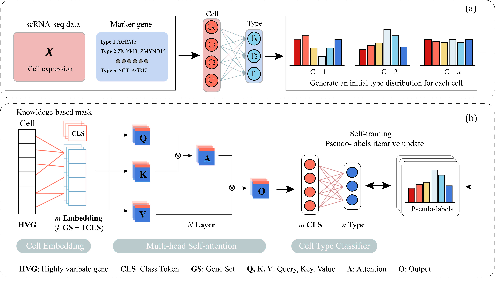

# sICTA: Interpretable Cell Type Annotation based on self-training

The full description of sICTA and its application on published single cell RNA-seq datasets are available.

Download archive with preprocessed data at: https://drive.google.com/drive/folders/1jbqSxacL_IDIZ4uPjq220C9Kv024m9eL.

The repository includes detailed installation instructions and requirements, scripts and demos.

Moreover, we have provided the docker image of sICTA_demo [here](https://drive.google.com/drive/folders/1jbqSxacL_IDIZ4uPjq220C9Kv024m9eL), which can be used with the following command.

```bash
docker load --input path_to/sicta_image.tar
docker run --gpus all sicta_demo:v1
```

## 1 The workflow of sICTA.



**(a)** Combining cell expression and marker gene specificity to generate pseudo-labels. **(b)**  The downstream Transformer classifiers are first pre-trained based on cell type probability distributions (pseudo-labels), followed by iterative refinement of the classifiers through a self-training framework until convergence. The sICTA takes the a priori knowledge from the biological domain and uses masked learnable embeddings to transform the input data ($G$ genes) into $k$ input tokens representing each gene set (GS) and a class token (CLS).

## 2 Installation
Create a new python environment.
```bash
conda create --name sICTA_env python=3.8.16
conda activate sICTA_env
```

Install the dependencies from the provided requirements.txt file.
```bash
pip install -r requirements.txt
```

## 3 Usage

### Data format

sICTA requires input of cell-by-cell gene matrices, pseudo-labelling information and true cell type information in .h5ad object format. 

The true cell type information is only used for prediction accuracy assessment. 

In addition, sICTA requires known associations between genes and pathways to be input in .gmt object format to construct interpretable networks.

We provide default data (Muraro.h5ad and GO_bp.gmt) for users to understand and debug sICTA code.

### Cell type annotation example
First let's load Muraro dataset. The data can be found in the data folder or [here](https://drive.google.com/drive/folders/1jbqSxacL_IDIZ4uPjq220C9Kv024m9eL).

```bash
import scanpy as sc
our_query_adata = sc.read('path_to/Muraro.h5ad') 
```

Then, run the sICTA.train() function. The trained model is stored in the hGOBP_demo folder.
```bash
import os
current_path = os.getcwd()
print(our_query_adata)
sICTA.train(our_query_adata, gmt_path='human_gobp', label_name='broad_cell_type',epochs=50,current_path = current_path, project='hGOBP_demo',batch_size = 128)
```

The learned Cell-Pathway Attention matrix can be extracted by the sICTA.pre() function.
```bash
model_weight_path = './hGOBP_demo/model-29.pth' #Storage Path for the Trained Model
adata, pre_list = sICTA.pre(our_query_adata, model_weight_path = model_weight_path,current_path = current_path,project='hGOBP_demo') #Model Prediction
adata.write("/mnt/rao/home/chenhg/R/Relate_method/TOSICA/sICTA/hGOBP_demo/Muraro_att.h5ad")  
```

Next, the Cell-Pathway Attention Matrix captured by the model can be visualised by a UMAP diagram and the performance can be evaluated using the adjusted_rand_score() and adjusted_mutual_info_score() functions of the sklearn package.
```bash
from sklearn.metrics import adjusted_rand_score, adjusted_mutual_info_score, silhouette_score #Clustering by Cell-Pathway Attention Matrix
sc.pp.normalize_total(adata, target_sum=1e4) 
sc.pp.log1p(adata)
sc.tl.pca(adata, svd_solver='arpack')
sc.pp.neighbors(adata)
sc.tl.umap(adata)
sc.tl.louvain(adata,resolution=0.3, key_added='louvain')
color = ['#E7B18E','#E9CCC3','#F2DFEA','#ADDBD7','#6BC3BA','#D8EDE6','#A2D194'] 
sc.pl.umap(adata, color=["broad_cell_type_2","louvain"], frameon=False, legend_fontsize=10,title='cell_type',wspace = 0.4,palette=color)  #save = "sCITA_draw_cell_typepdf"
print("sICTA   Adjusted_rand_score   "+str(adjusted_rand_score(adata.obs['broad_cell_type_2'],adata.obs['louvain']))+"   Adjusted_mutual_info_score   "+str(adjusted_mutual_info_score(adata.obs['broad_cell_type_2'],adata.obs['louvain'])))
```

We can further analyse the differential expression pathways for each subpopulation captured by the attention matrix
```bash
import pandas as pd
sc.tl.rank_genes_groups(adata, 'louvain', method='wilcoxon')  
dc_pathway = pd.DataFrame(adata.uns['rank_genes_groups']['names'])
dc_pathway.head(5)
```
## Reference

If you use `sICTA` in your work, please cite